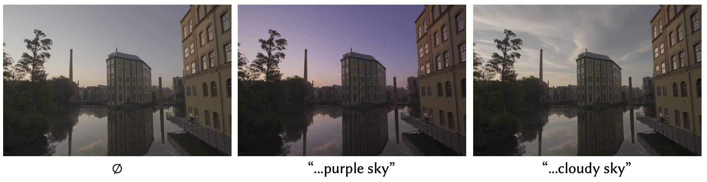

# X2HDR: HDR Image Generation in a Perceptually Uniform Space
<!-- [](https://arxiv.org/abs/2411.16602) -->
[](http://x2hdr.github.io/)


## Setup
```shell
conda create -n x2hdr python=3.10
conda activate x2hdr

pip3 install torch==2.6.0 torchvision==0.21.0 --index-url https://download.pytorch.org/whl/cu124
pip install -r requirements.txt
```


## Download Pretrained Models

```shell
mkdir models

# Download FLUX.1-dev model
hf download --local-dir ./models/Flux black-forest-labs/FLUX.1-dev

# Text-to-HDR and RAW-to-HDR LoRA
hf download --local-dir ./models x2hdr/HDR
```

## HDR Visualization

To visualize HDR images, you can use [tev](https://github.com/Tom94/tev) (downloadable HDR viewer) or [OpenHDR](https://viewer.openhdr.org/) (web-based HDR viewer).

## Inference: Text-to-HDR Image Generation

The following command will read prompts from [`test/text2hdr.txt`](test/text2hdr.txt) (100 text prompts used for comparison) to generate HDR images:
```shell
python infer_text2hdr.py --batch_prompts test/text2hdr.txt
```

The generation parameters have been included in the prompt file. Command line parameter explanations:
- `--w`: width
- `--h`: height
- `--d`: seed
- `--g`: guidance scale
- `--s`: number of inference steps

If `batch_prompts` is not specified, you can specify a single prompt to generate:
```shell
python infer_text2hdr.py \
    --prompt "PU21, masterpiece, 4K, sharp and detailed, high resolution, best quality, A grand, dimly lit hall with a single candle in the foreground" \
    --width 1024 \
    --height 1024 \
    --seed 2026 \
    --guidance_scale 3.5 \
    --num_inference_steps 40
```

The inference script will output both an HDR image (in EXR format) and an LDR image (in PNG format). The LDR image is provided **only** for quick visualization, which is helpful when viewing image content on remote servers where direct inspection of EXR files is inconvenient.

> [!NOTE]  
> - **Memory Requirements**: The inference script requires approximately 45GB of GPU memory for 1024×1024 images and 33GB of GPU memory for 512×512 images.
>
> - **Trigger Word**: All prompts begin with `PU21`, which serves as the required trigger word for the HDR LoRA model.
>
> - **Output Luminance**: The generated HDR images are scaled so that their 99.5th percentile luminance equals the `target_luminance` (default: 16.0).
>
> - **Dynamic Range**: We observe the dynamic range of the generated HDR images is related to the number of inference steps and different random seeds.
>
> - **Banding Effect**: We observe banding artifacts in some of the test prompts (i.e., prompt 33), particularly in smooth, dark areas. While switching to `float32` can resolve this problem, it increases memory usage and inference time. Therefore, we continue to use `bfloat16` by default, as it produces realistic HDR images for most cases while remaining efficient.

## Inference: RAW-to-HDR Image Reconstruction

To reconstruct an HDR image from a RAW image, run:
```shell
python infer_raw2hdr.py --raw_image test/test_raw.CR2 --width 720 --height 480
```

Optionally, you can provide a text prompt to guide the reconstruction of over-saturated regions:
```shell
python infer_raw2hdr.py --raw_image test/test_raw.CR2 --width 720 --height 480 --prompt "A serene riverside scene with purple sky featuring historic industrial buildings, with their reflections mirrored perfectly on the calm water."
```

<p align="center">
  
</p>


> [!NOTE]  
> - **RAW Image I/O**: We use [`HDRutils`](https://github.com/gfxdisp/HDRUtils) for RAW image I/O, which can convert RAW images to `.exr` format. Therefore, our `infer_raw2hdr.py` script supports both RAW image files and `.exr` files as input.
>
> - **Downsampling**: RAW images typically have high resolution. Since FLUX cannot process such high resolutions, the input image is first downsampled to `width × height`.
>
> - **Text-Guided Hallucination**: For RAW-to-HDR without text prompt, the defaults are `guidance_scale=3.5` and `num_inference_steps=30`. When using a text prompt to guide the hallucination, you can increase these values to get results that better match the text prompt. You can also change the default `seed=2026` to get different results.

## Training
Please refer to the [training README](train/README.md) for more details.

## Test
Please refer to the [test README](test/README.md) for more details.

## Evaluation (RAW-to-HDR)
Please refer to the [evaluation README](eval/README.md) for more details.

## HDR Video Generation
Our training paradigm can be extended to HDR video generation. We finetune `Wan2.2-TI2V-5B` on an internal HDR video dataset for 15,000 steps using PQ encoding. The finetuned model supports text-to-video generation.
We present 8 example HDR videos generated by the model. Due to limited computational resources, we adopt a relatively small T2V model as the baseline, leading to suboptimal video quality.
<table border="0" style="width: 100%; text-align: left; margin-top: 20px;">
  <tr>
      <td>
          <video src="https://github.com/user-attachments/assets/c3bf412a-9dbf-43a9-8673-958b833a1a44" width="100%" autoplay muted loop playsinline></video>
      </td>
      <td>
          <video src="https://github.com/user-attachments/assets/71a832c0-b773-435b-b3ae-b9dd10503bd8" width="100%" autoplay muted loop playsinline></video>
      </td>
      <td>
          <video src="https://github.com/user-attachments/assets/5836c42b-1ee9-468c-98e3-d5c0fb24d0cf" width="100%" autoplay muted loop playsinline></video>
      </td>
      <td>
          <video src="https://github.com/user-attachments/assets/ec2cbc9c-9a0b-4c9c-9445-ff443888576e" width="100%" autoplay muted loop playsinline></video>
      </td>
  </tr>
  <tr>
      <td>
          <video src="https://github.com/user-attachments/assets/c09e71f8-f7b1-4bc7-9c34-a1f80e4c9871" width="100%" autoplay muted loop playsinline></video>
      </td>
      <td>
          <video src="https://github.com/user-attachments/assets/ce0656de-71ac-46fc-ace4-d4806d515c2f" width="100%" autoplay muted loop playsinline></video>
      </td>
      <td>
          <video src="https://github.com/user-attachments/assets/d6c63640-52ab-4569-adc0-cffac8a39c9b" width="100%" autoplay muted loop playsinline></video>
      </td>
      <td>
          <video src="https://github.com/user-attachments/assets/e971f773-ae48-4ebf-884a-0692ac91d429" width="100%" autoplay muted loop playsinline></video>
      </td>
  </tr>
</table>
This paradigm can also be extended to HDR video reconstruction.
