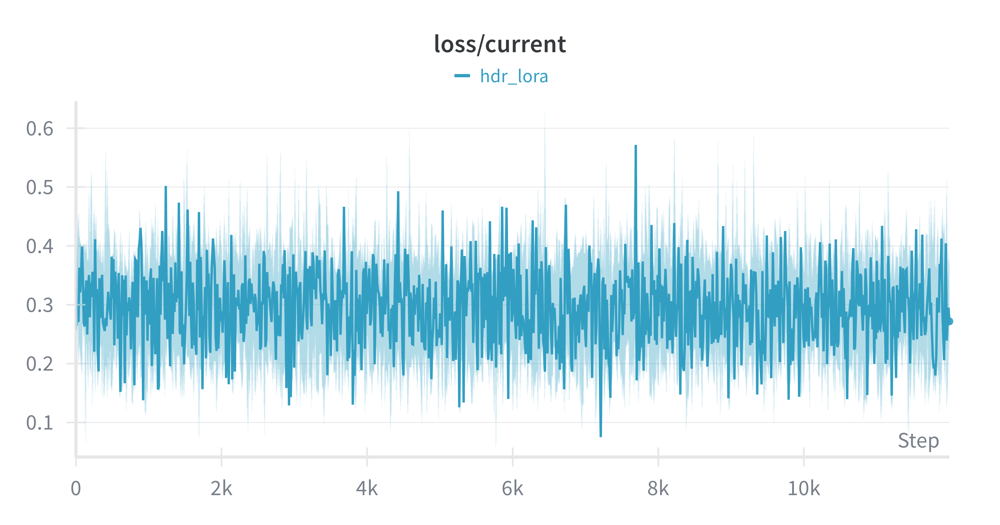
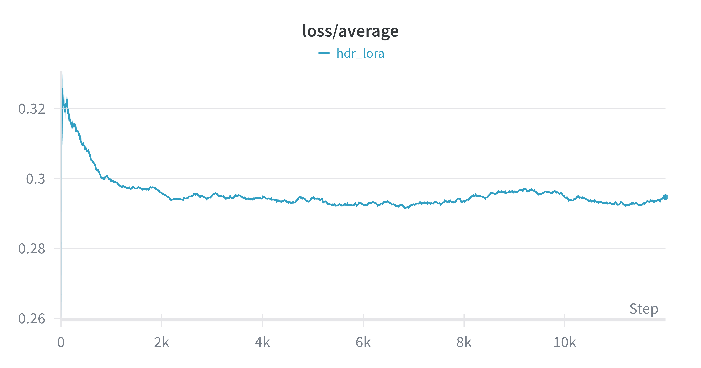

# Text-to-HDR Training

## Framework

This training framework is built upon the [`sd-scripts`](https://github.com/kohya-ss/sd-scripts/tree/sd3) repository (`sd3` branch). For general training inquiries, please consult the original [sd-scripts issues](https://github.com/kohya-ss/sd-scripts/issues) or [documentation](https://github.com/kohya-ss/sd-scripts/blob/sd3/docs/flux_train_network.md).

This implementation is based on a fork from **August 20, 2024**. Since the original framework is continuously updated, the code in the `text2hdr` directory may differ from the current upstream repository.

## Setup

Activate the conda environment created in the root directory:

```shell
conda activate x2hdr
```

## Model Preparation

The training framework requires specific model components. The core FLUX.1 and VAE models are shared with the inference pipeline.

You can either copy your existing `flux1-dev.safetensors` and `ae.safetensors` to the `models` directory or update the paths in the training script. The text encoders must be downloaded if they are not already available.

```shell
mkdir models

# 1. FLUX.1 Model (Same as inference)
huggingface-cli download --local-dir ./models black-forest-labs/FLUX.1-dev --include "flux1-dev.safetensors"

# 2. VAE Model (Same as inference)
huggingface-cli download --local-dir ./models black-forest-labs/FLUX.1-dev --include "ae.safetensors"

# 3. Text Encoders (T5-XXL and CLIP-L)
huggingface-cli download --local-dir ./models comfyanonymous/flux_text_encoders --include "t5xxl_fp16.safetensors"
huggingface-cli download --local-dir ./models comfyanonymous/flux_text_encoders --include "clip_l.safetensors"
```

## Dataset

Due to its large size, the training dataset is not provided directly. Please generate the dataset following the instructions in the paper.

Prepare a metadata JSON file in the following format:

```json
{
  "absolute/path/to/hdr/image_1.exr": {
    "caption": "This image shows the corner of a bright, minimalist room with...",
    "caption_long": "The corner of a bright and minimalist room is captured in this image. A large window provides a view of..."
  },

  "absolute/path/to/hdr/image_2.exr": {
    "caption": ...,
    "caption_long": ...
  },

  ...
}
```

> [!NOTE]
> **Captions:** Although our dataset includes both `caption` (short) and `caption_long` for each HDR image, the code supports single captions as well (see [code](library/train_util.py#L2250)).
>
> **Configuration:** Update the dataset and metadata paths in [`config/dataset.toml`](config/dataset.toml).
>
> **Image Resolution:** The code automatically reads image dimensions before training (see [code](library/train_util.py#L1486)), which is time-consuming. To accelerate this initialization, you can organize images of the same resolution into specific folders and customize the code to infer dimensions from the folder names.
>
> **Memory:** Training requires approximately 44GB of VRAM.

## Training

Run the training script using the following command:

```shell
bash scripts/train.sh
```

Here, we show the loss curve from our experiment using the provided training script. The actual training consisted of 3000 steps, but the curve displays 12000 steps due to gradient accumulation with 4 accumulation steps (3000 × 4 = 12000).
<p align="center">
  
  
</p>

## Inference

To perform inference using the `diffusers` library, use the `infer_text2hdr.py` script in the root directory.

Alternatively, you can use the minimal inference script provided in this directory:

```shell
bash scripts/inference.sh
```

> [!NOTE]
> Ensure you update the LoRA weights path in `inference.sh` to point to your newly trained model.
>
> The two inference scripts may produce slightly different results due to the different sampling methods.